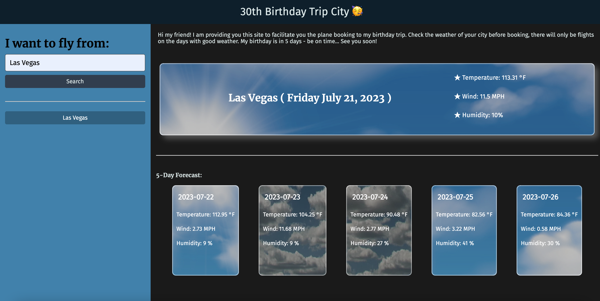
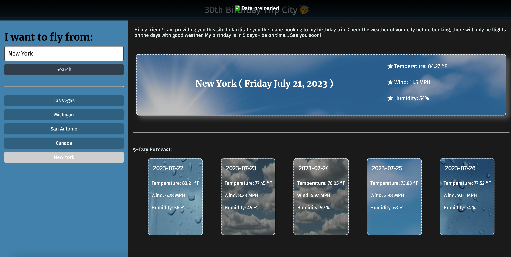
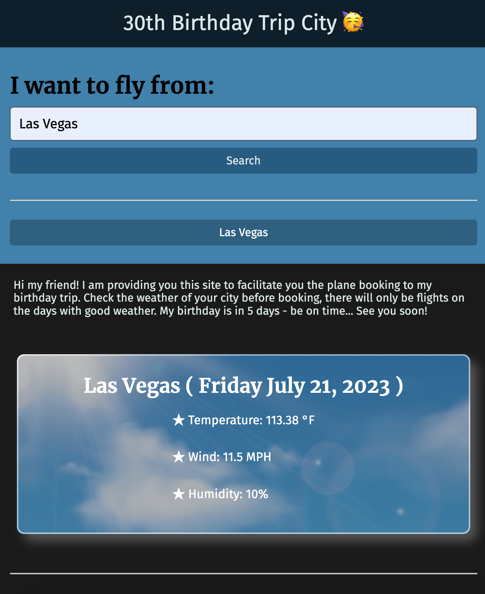

# Birthday-Trip-Weather

### ~ Server-Side APIs Challenge: Weather Dashboard ☁️

## Description

## Table of Contents (Optional)

- [Installation](#installation)
- [Usage](#usage)
- [Credits](#credits)
- [License](#license)

## Installation

To run the project in your local machine:

1. Open visual studio in your computer or laptop
2. Clone the git project: https://github.com/lilianpatinoortiz/Birthday-Trip-Weather
3. Pull the latest from the 'main' branch
4. Locate the index.html file
5. Right click on the file and select "Open in default browser"
6. A new window on your default browser should open with the web page containing the project

Access the deployed project here: https://lilianpatinoortiz.github.io/Birthday-Trip-Weather/

## Usage

TBD

## Credits

The main resources used:

- Bootcamp canvas - Module 05

## License

Please refer to the LICENSE in the repo.

