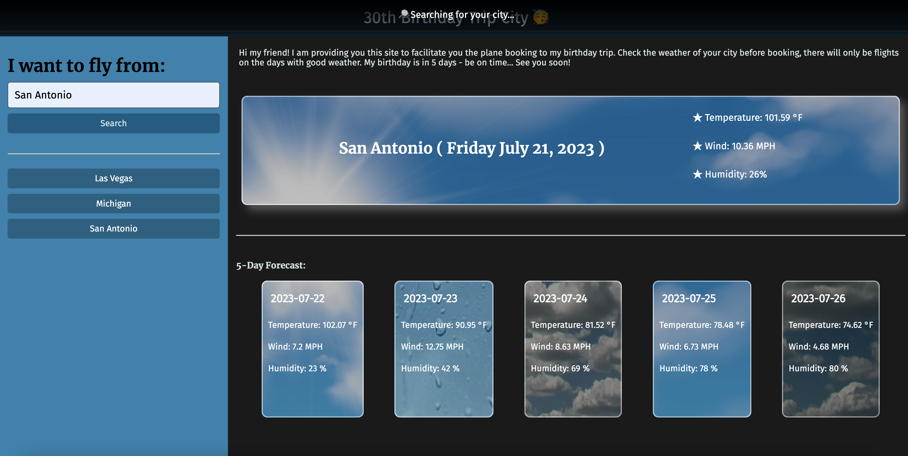

# Birthday-Trip-Weather

### ~ Server-Side APIs Challenge: Weather Dashboard ☁️

## Description

In this challenge I was able to connect to third APIs to get data already stored by other sites! Which allows me to iimprove my site and focus on how I want to display my data and use it to make my site work. It was a really fun challenge! 

## Table of Contents (Optional)

- [Installation](#installation)
- [Usage](#usage)
- [Credits](#credits)
- [License](#license)

## Installation

To run the project in your local machine:

1. Open visual studio in your computer or laptop
2. Clone the git project: https://github.com/lilianpatinoortiz/Birthday-Trip-Weather
3. Pull the latest from the 'main' branch
4. Locate the index.html file
5. Right click on the file and select "Open in default browser"
6. A new window on your default browser should open with the web page containing the project

Access the deployed project here: https://lilianpatinoortiz.github.io/Birthday-Trip-Weather/

## Usage

Make sure you check the weather of your prefered cities - to be able to take a flight to be on my birthday party! See you soon 🥳

Once you get the project (or open de deployed one) you will be able to search for cities and see their weather. You will be able to see toodays weather and the next 5 days weather too. You will be provided with historic buttons, so we dont have to call the APIs again if you are searching for the same city in the same date.
If you try to search for a city that you previously searched, but in a different date, the API call will be done again since the weather changed.
For each action we show a notification, just to let know the user from where we are getting the data - api call, previously stored or if there is any error on searc hing for the city.

## Credits

The main resources used:

- Bootcamp canvas - Module 05

## License

Please refer to the LICENSE in the repo.

